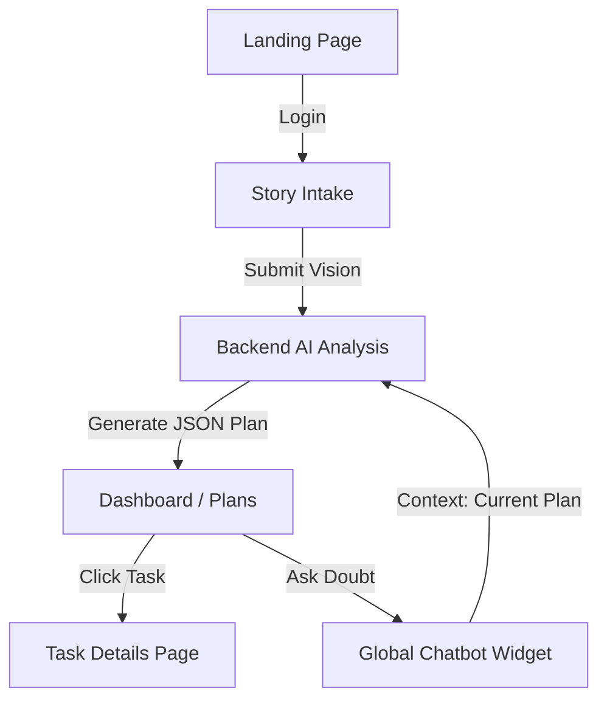

# Startup Canvas - Complete Website Analysis

## 📋 Executive Summary

**Startup Canvas** is an AI-powered startup management platform that helps founders transform their ideas into structured execution plans. Originally a frontend-only demo, the application has evolved into a **full-stack solution** with a **React frontend** and a **Python FastAPI backend**.

The platform leverages **Arcee AI Trinity** (via OpenRouter) to generate detailed, multi-phase startup plans from simple user vision statements. It features a modern, responsive UI with vertical timeline tracking, detailed task cheat sheets, and a persistent AI mentor chatbot.

---

## 🏗️ Project Architecture

### 📂 Full Stack Structure

```
startup-canvas-main/
├── backend/                   # Python FastAPI Backend
│   ├── api/
│   │   └── openrouter.py      # AI Integration (Arcee AI Trinity)
│   ├── .env                   # API Keys (OpenRouter)
│   ├── main.py                # API Endpoints
│   └── requirements.txt       # Python dependencies
├── frontend/                  # React Frontend (Vite)
│   ├── src/
│   │   ├── components/
│   │   │   ├── ChatWidget.tsx # Global AI Chatbot
│   │   │   └── ui/            # shadcn/ui library
│   │   ├── context/
│   │   │   └── PlanContext.tsx # Central state & localStorage
│   │   ├── pages/
│   │   │   ├── StoryIntake.tsx # Vision input & generation
│   │   │   ├── Plans.tsx       # Vertical timeline view
│   │   │   ├── TaskDetailsPage.tsx # Detailed task sheets
│   │   │   └── ...
│   │   ├── App.tsx             # Routing & Global Layout
│   │   └── main.tsx            # Entry point
│   ├── package.json
│   └── WEBSITE_ANALYSIS.md    # This documentation
```

---

## 🎨 Technology Stack

### Frontend
- **Framework**: React 18.3.1 (Vite)
- **Language**: TypeScript
- **Styling**: Tailwind CSS + shadcn/ui
- **State**: React Context API (with `localStorage` persistence)
- **Animations**: Framer Motion + Lucide React icons

### Backend
- **Framework**: FastAPI (Python)
- **Server**: Uvicorn
- **API Client**: HTTPX (Asynchronous)
- **AI Model**: `arcee-ai/trinity-large-preview:free` (via OpenRouter)

---

## 🔄 Application Workflow

### Complete User Journey



1. **Vision Intake**: User describes their startup idea and selects a timeline (e.g., 30 days).
2. **AI Processing**: The vision is sent to the FastAPI backend. Arcee AI generates a structured JSON plan with specific tasks, priorities, and phases (Validation, Build, Launch).
3. **Persistence**: The plan is stored in the frontend `PlanContext` and persisted to `localStorage`, allowing for session persistence.
4. **Execution Tracking**: The user navigates through a **Vertical Timeline** representing different startup phases.
5. **Guidance**: A persistent **AI Mentor** chatbot is available on every page, aware of the user's specific startup plan context.

---

## 📄 Core Feature Analysis

### 1. Story Intake & Plan Generation
- **Logic**: Uses a structured prompt to force the LLM to return valid JSON.
- **Model**: Powered by `arcee-ai/trinity-large-preview:free`.
- **Output**: A title, summary, and a list of tasks with unique IDs and statuses.

### 2. Vertical Timeline (Plans Page)
- **UI**: A responsive vertical timeline that groups tasks by phase (**Validation**, **Build**, **Launch**).
- **Interactivity**: Clicking any task navigates to a dedicated detail view.
- **Progress Tracking**: Visual indicators for completed vs. pending tasks.

### 3. Task Details Page
- **Content**: Displays specific "Cheat Sheets", "Discussions", and "Notes" for every generated task.
- **Navigation**: Allows easy switching between related tasks in the same phase.

### 4. Global AI Chatbot (Mentor)
- **Location**: Floating widget on the bottom-right of all pages.
- **Context Awareness**: Automatically injects the user's current startup title, summary, and tasks into the prompt.
- **Capabilities**: Explains tasks, suggests pivots, and provides startup advice based on the generated plan.

---

## 💾 Data Management

- **Persistence Layer**: All active startup data is stored in the browser's `localStorage` via `PlanContext`.
- **Backend Role**: The backend is **stateless**. It focuses purely on coordinating requests between the frontend and the OpenRouter API.

---

## 🚀 Running the Platform

### Backend
```bash
cd backend
python -m venv venv
source venv/bin/activate
pip install -r requirements.txt
uvicorn main:app --reload --host 127.0.0.1 --port 8000
```

### Frontend
```bash
cd frontend
npm install
npm run dev -- --port 8080
```

---

## 🔮 Future Roadmap
1. **Database Persistence**: Move `localStorage` data to a persistent database (PostgreSQL/Supabase).
2. **Real-time Collaboration**: Allow multiple team members to view and update the same startup plan.
3. **Dynamic Task Updates**: Allow the AI to modify specific tasks within an existing plan based on feedback.

---

*Last Updated: February 10, 2026*
